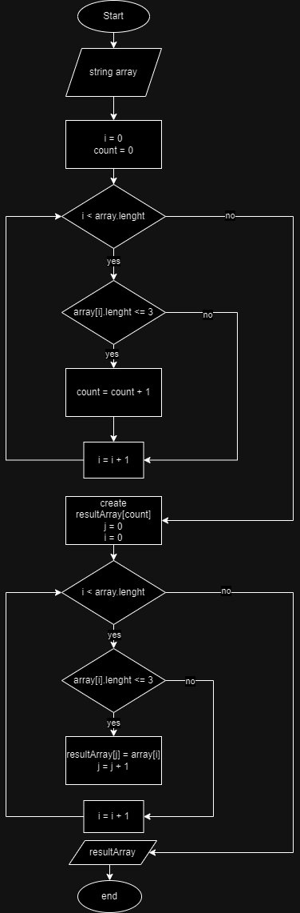

# Итоговая контрольная работа по основному блоку

**Условия задачи:**\
Написать программу, которая из имеющегося массива строк формирует новый массив из строк, длина которых меньше, либо равна 3 символам. Первоначальный массив можно ввести с клавиатуры, либо задать на старте выполнения алгоритма. При решении не рекомендуется пользоваться коллекциями, лучше обойтись исключительно массивами.

**Решение:**
* создаем массив;
* наполняем массив строками (ввод в консоли);
* производим подсчета количества элементов в массиве, длина которых меньше либо равна 3 символа;
* создаем новый массив размером, равным количеству подсчитанных элементов;
* заполняем новый массив элементами, длина которых меньше либо равна 3 символа;
* выводим на печать исходный массив и и новый массив.

**Блок схема:**

